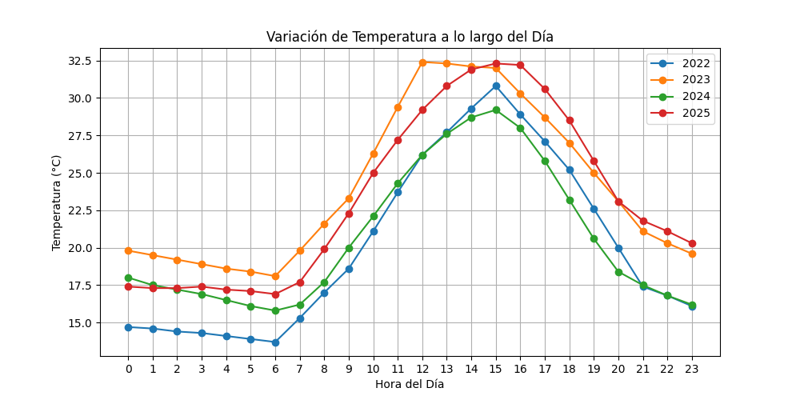
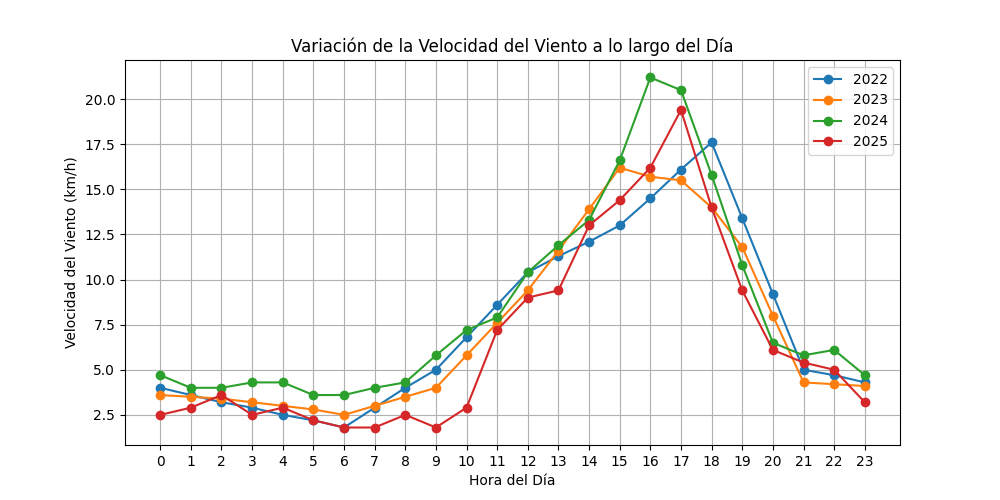
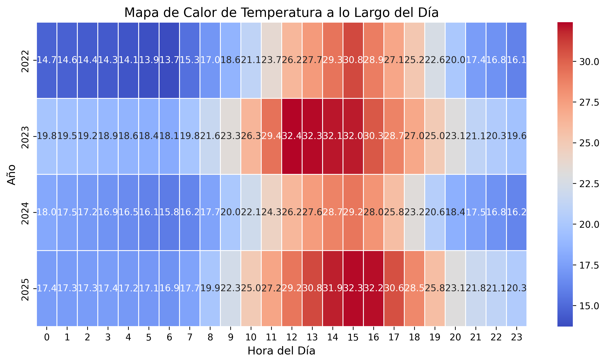
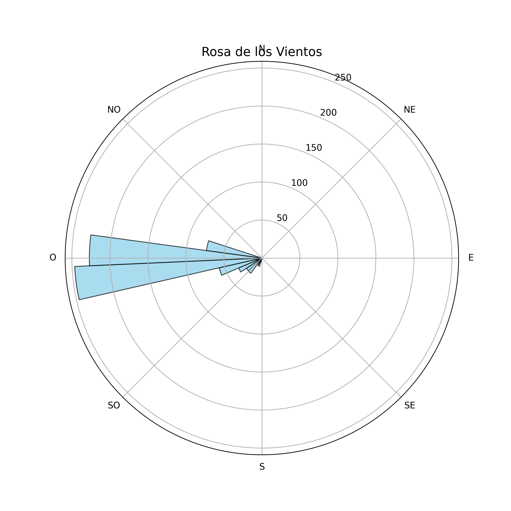
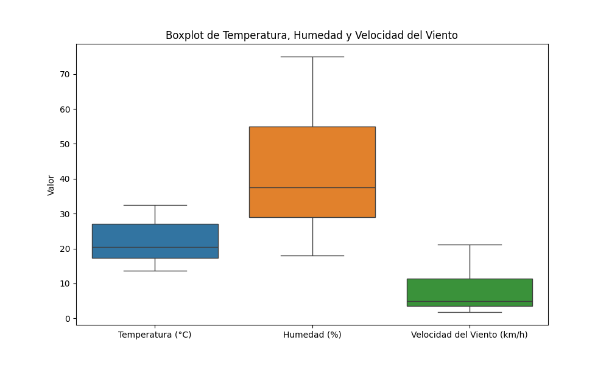

# 🌤️ Análisis de Datos Climáticos de Maipú

## 📌 Descripción
Este proyecto analiza datos climáticos históricos de Maipú, utilizando Python para la extracción, transformación y visualización de los datos. Se incluyen diversos gráficos y análisis estadísticos para comprender patrones meteorológicos como temperatura, humedad y velocidad del viento.

## 💾 Estructura del Proyecto
```
📂 clima
🌍 graficos                 # Carpeta con gráficos generados
    📏 animacion_temperatura_3D.gif  
    📏 boxplot_variables.png  
    📏 clima_diario.png  
    📏 comparacion_Temperatura_Humedad.png  
    📏 dispersion3D.png  
    📏 histograma_temperatura.png  
    📏 humedad_diaria.png  
    📏 mapa_calor_temperatura.png  
    📏 rosa_vientos.png  
    📏 temperatura_diaria.png  
    📏 velocidad_viento.png  
📁 clima_maipu.json             # Datos originales en JSON
📁 clima_maipu_extracted.csv     # Datos procesados en CSV
📁 clima_maipu.xlsx             # Datos en formato Excel
📚 extract_and_save_data.py      # Script para extracción y guardado de datos
📚 generar_graficos.py           # Script para generar gráficos
📚 README.md                     # Documentación del proyecto
```

---

## 🚀 Instalación y Uso

1️⃣ **Clonar el repositorio:**
```bash
git clone https://github.com/IvanAlexisMejias/analisis-Datos-Clima-Maipu.git
cd analisis-Datos-Clima-Maipu
```

2️⃣ **Instalar dependencias:**
```bash
pip install -r requirements.txt
```

3️⃣ **Ejecutar el análisis de datos:**
```bash
python extract_and_save_data.py
```

4️⃣ **Generar gráficos:**
```bash
python generar_graficos.py
```

---

## 📊 Hallazgos Principales

💡 **Tendencias de Temperatura:** Se observa un aumento progresivo en la temperatura durante los años analizados, con temperaturas máximas alcanzadas entre las 12:00 y 16:00 hrs.

💡 **Patrones de Humedad:** La humedad tiende a disminuir a medida que la temperatura aumenta, alcanzando sus valores más bajos alrededor del mediodía.

💡 **Velocidad del Viento:** La velocidad del viento muestra picos en la tarde, con valores más bajos durante la noche y la mañana.

💡 **Distribución del Clima:** Predomina el clima soleado, con algunas horas de cielos parcialmente nublados, especialmente en la tarde y noche.

💡 **Correlaciones Clave:** Existe una correlación negativa entre temperatura y humedad, mientras que la velocidad del viento tiende a aumentar cuando la humedad disminuye.

---

## 🌈 Visualizaciones

El análisis incluye diversos gráficos que representan los datos climáticos:

📉 **Temperatura a lo largo del día:**  


📉 **Velocidad del viento:**  


📉 **Mapa de calor de temperatura:**  


📉 **Rosa de los vientos:**  


📉 **Diagrama de dispersión 3D:**  


📉 **Boxplot de temperatura, humedad y viento:**  


---

## 📚 Tecnologías Utilizadas

✅ **Python**  
✅ **Pandas** - Manipulación de datos  
✅ **Matplotlib / Seaborn** - Visualización  
✅ **NumPy** - Análisis numérico  
✅ **mpl_toolkits.mplot3d** - Gráficos en 3D  

---

## 📢 Contacto

📝 **Desarrollado por:** [Ivan Alexis Mejias](https://github.com/IvanAlexisMejias)  

---

🚀 **Si te gustó este proyecto, no olvides darle una ⭐ en GitHub!**

